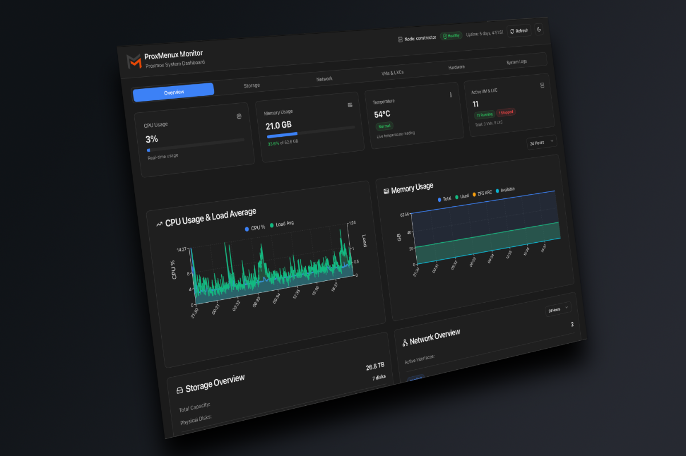

# ProxMenux Monitor

A modern, responsive dashboard for monitoring Proxmox VE systems built with Next.js and React.

---

## Table of Contents

- [Overview](#overview)
- [Features](#features)
- [Technology Stack](#technology-stack)
- [Installation](#installation)
- [Authentication & Security](#authentication--security)
  - [Setup Authentication](#setup-authentication)
  - [Two-Factor Authentication (2FA)](#two-factor-authentication-2fa)
  - [Security Best Practices for API Tokens](#security-best-practices-for-api-tokens)
- [API Documentation](#api-documentation)
  - [API Authentication](#api-authentication)
  - [Generating API Tokens](#generating-api-tokens)
  - [Available Endpoints](#available-endpoints)
- [Integration Examples](#integration-examples)
  - [Homepage Integration](#homepage-integration)
  - [Home Assistant Integration](#home-assistant-integration)
- [License](#license)

---

## Overview

**ProxMenux Monitor** is a comprehensive, real-time monitoring dashboard for Proxmox VE environments. Built with modern web technologies, it provides an intuitive interface to monitor system resources, virtual machines, containers, storage, network traffic, and system logs.

The application runs as a standalone AppImage on your Proxmox server and serves a web interface accessible from any device on your network.


## Screenshots

Get a quick overview of ProxMenux Monitor's main features:

<p align="center">
  
  <br/>
  <em>System Overview - Monitor CPU, memory, temperature, and uptime in real-time</em>
</p>


---

## Features

- **System Overview**: Real-time monitoring of CPU, memory, temperature, and system uptime
- **Storage Management**: Visual representation of storage distribution, disk health, and SMART data
- **Network Monitoring**: Network interface statistics, real-time traffic graphs, and bandwidth usage
- **Virtual Machines & LXC**: Comprehensive view of all VMs and containers with resource usage and controls
- **Hardware Information**: Detailed hardware specifications including CPU, GPU, PCIe devices, and disks
- **System Logs**: Real-time system log monitoring with filtering and search capabilities
- **Health Monitoring**: Proactive system health checks with persistent error tracking
- **Authentication & 2FA**: Optional password protection with TOTP-based two-factor authentication
- **RESTful API**: Complete API access for integrations with Homepage, Home Assistant, and custom dashboards
- **Dark/Light Theme**: Toggle between themes with Proxmox-inspired design
- **Responsive Design**: Works seamlessly on desktop, tablet, and mobile devices
- **Release Notes**: Automatic notifications of new features and improvements

## Technology Stack

- **Frontend**: Next.js 15, React 19, TypeScript
- **Styling**: Tailwind CSS v4 with custom Proxmox-inspired theme
- **Charts**: Recharts for data visualization
- **UI Components**: Radix UI primitives with shadcn/ui
- **Backend**: Flask (Python) server for system data collection
- **Packaging**: AppImage for easy distribution and deployment

## Installation

**ProxMenux Monitor is integrated into [ProxMenux](https://proxmenux.com) and comes enabled by default.** No manual installation is required if you're using ProxMenux.

The monitor automatically starts when ProxMenux is installed and runs as a systemd service on your Proxmox server.

### Accessing the Dashboard

You can access ProxMenux Monitor in two ways:

1. **Direct Access**: `http://your-proxmox-ip:8008`
2. **Via Proxy** (Recommended): `https://your-domain.com/proxmenux-monitor/`

**Note**: All API endpoints work seamlessly with both direct access and proxy configurations. When using a reverse proxy, the application automatically detects and adapts to the proxied environment.

### Proxy Configuration

ProxMenux Monitor includes built-in support for reverse proxy configurations. If you're using Nginx, Caddy, or Traefik, the application will automatically:

- Detect the proxy headers (`X-Forwarded-For`, `X-Forwarded-Proto`, `X-Forwarded-Host`)
- Adjust API endpoints to work correctly through the proxy
- Maintain full functionality for all features including authentication and API access


## Authentication & Security

ProxMenux Monitor includes an optional authentication system to protect your dashboard with a password and two-factor authentication.

### Setup Authentication

On first launch, you'll be presented with three options:

1. **Set up authentication** - Create a username and password to protect your dashboard
2. **Enable 2FA** - Add TOTP-based two-factor authentication for enhanced security
3. **Skip** - Continue without authentication (not recommended for production environments)


### Two-Factor Authentication (2FA)

After setting up your password, you can enable 2FA using any TOTP authenticator app (Google Authenticator, Authy, 1Password, etc.):

1. Navigate to **Settings > Authentication**
2. Click **Enable 2FA**
3. Scan the QR code with your authenticator app
4. Enter the 6-digit code to verify
5. Save your backup codes in a secure location


### Security Best Practices for API Tokens

**IMPORTANT**: Never hardcode your API tokens directly in configuration files or scripts. Instead, use environment variables or secrets management.

**Option 1: Environment Variables**

Store your token in an environment variable:

```bash
# Linux/macOS - Add to ~/.bashrc or ~/.zshrc
export PROXMENUX_API_TOKEN="your_actual_token_here"

# Windows PowerShell - Add to profile
$env:PROXMENUX_API_TOKEN = "your_actual_token_here"
```

Then reference it in your scripts:

```bash
# Linux/macOS
curl -H "Authorization: Bearer $PROXMENUX_API_TOKEN" \
  http://your-proxmox-ip:8008/api/system

# Windows PowerShell
curl -H "Authorization: Bearer $env:PROXMENUX_API_TOKEN" `
  http://your-proxmox-ip:8008/api/system
```

**Option 2: Secrets File**

Create a dedicated secrets file (make sure to add it to `.gitignore`):

```bash
# Create secrets file
echo "PROXMENUX_API_TOKEN=your_actual_token_here" > ~/.proxmenux_secrets

# Secure the file (Linux/macOS only)
chmod 600 ~/.proxmenux_secrets

# Load in your script
source ~/.proxmenux_secrets
```

**Option 3: Homepage Secrets (Recommended)**

Homepage supports secrets management. Create a `secrets.yaml` file:

```yaml
# secrets.yaml (add to .gitignore!)
proxmenux_token: "your_actual_token_here"
```

Then reference it in your `services.yaml`:

```yaml
- ProxMenux Monitor:
    widget:
      type: customapi
      url: http://proxmox.example.tld:8008/api/system
      headers:
        Authorization: Bearer {{HOMEPAGE_VAR_PROXMENUX_TOKEN}}
```

**Option 4: Home Assistant Secrets**

Home Assistant has built-in secrets support. Edit `secrets.yaml`:

```yaml
# secrets.yaml
proxmenux_api_token: "your_actual_token_here"
```

Then reference it in `configuration.yaml`:

```yaml
sensor:
  - platform: rest
    name: ProxMenux CPU
    resource: http://proxmox.example.tld:8008/api/system
    headers:
      Authorization: !secret proxmenux_api_token
```

**Token Security Checklist:**
- ✅ Store tokens in environment variables or secrets files
- ✅ Add secrets files to `.gitignore`
- ✅ Set proper file permissions (chmod 600 on Linux/macOS)
- ✅ Rotate tokens periodically (every 3-6 months)
- ✅ Use different tokens for different integrations
- ✅ Delete tokens you no longer use
- ❌ Never commit tokens to version control
- ❌ Never share tokens in screenshots or logs
- ❌ Never hardcode tokens in configuration files

---

## API Documentation

ProxMenux Monitor provides a comprehensive RESTful API for integrating with external services like Homepage, Home Assistant, or custom dashboards.

### API Authentication

When authentication is enabled on ProxMenux Monitor, all API endpoints (except `/api/health` and `/api/auth/*`) require a valid JWT token in the `Authorization` header.

### API Endpoint Base URL

**Direct Access:**
```
http://your-proxmox-ip:8008/api/
```

**Via Proxy:**
```
https://your-domain.com/proxmenux-monitor/api/
```

**Note**: All API examples in this documentation work with both direct and proxied URLs. Simply replace the base URL with your preferred access method.

### Generating API Tokens

To use the API with authentication enabled, you need to generate a long-lived API token.

#### Option 1: Generate via Web Panel (Recommended)

The easiest way to generate an API token is through the ProxMenux Monitor web interface:

1. Navigate to **Settings** tab in the dashboard
2. Scroll to the **API Access Tokens** section
3. Enter your password
4. If 2FA is enabled, enter your 6-digit code
5. Provide a name for the token (e.g., "Homepage Integration")
6. Click **Generate Token**
7. Copy the token immediately - it will not be shown again


The token will be valid for **365 days** (1 year) and can be used for integrations with Homepage, Home Assistant, or any custom application.

#### Option 2: Generate via API Call

For advanced users or automation, you can generate tokens programmatically:

```bash
curl -X POST http://your-proxmox-ip:8008/api/auth/generate-api-token \
  -H "Content-Type: application/json" \
  -d '{
    "username": "your-username",
    "password": "your-password",
    "totp_token": "123456",
    "token_name": "Homepage Integration"
  }'
```

**Response:**
```json
{
  "success": true,
  "token": "eyJhbGciOiJIUzI1NiIsInR5cCI6IkpXVCJ9...",
  "token_name": "Homepage Integration",
  "expires_in": "365 days",
  "message": "API token generated successfully. Store this token securely, it will not be shown again."
}
```

**Notes:**
- If 2FA is enabled, include the `totp_token` field with your 6-digit code
- If 2FA is not enabled, omit the `totp_token` field
- The token is valid for **365 days** (1 year)
- Store the token securely - it cannot be retrieved again

#### Option 3: Generate via cURL (without 2FA)

```bash
# Without 2FA
curl -X POST http://your-proxmox-ip:8008/api/auth/generate-api-token \
  -H "Content-Type: application/json" \
  -d '{"username":"pedro","password":"your-password","token_name":"Homepage"}'
```

### Using API Tokens

Once you have your API token, include it in the `Authorization` header of all API requests:

```bash
curl -H "Authorization: Bearer YOUR_API_TOKEN_HERE" \
  http://your-proxmox-ip:8008/api/system
```

---

### Available Endpoints

Below is a complete list of all API endpoints with descriptions and example responses.

#### System & Metrics

| Endpoint | Method | Auth Required | Description |
|----------|--------|---------------|-------------|
| `/api/system` | GET | Yes | Complete system information (CPU, memory, temperature, uptime) |
| `/api/system-info` | GET | No | Lightweight system info for header (hostname, uptime, health) |
| `/api/node/metrics` | GET | Yes | Historical metrics data (RRD) for CPU, memory, disk I/O |
| `/api/prometheus` | GET | Yes | Export metrics in Prometheus format |

**Example `/api/system` Response:**
```json
{
  "hostname": "pve",
  "cpu_usage": 15.2,
  "memory_usage": 45.8,
  "temperature": 42.5,
  "uptime": 345600,
  "kernel": "6.2.16-3-pve",
  "pve_version": "8.0.3"
}
```

#### Storage

| Endpoint | Method | Auth Required | Description |
|----------|--------|---------------|-------------|
| `/api/storage` | GET | Yes | Complete storage information with SMART data |
| `/api/storage/summary` | GET | Yes | Optimized storage summary (without SMART) |
| `/api/proxmox-storage` | GET | Yes | Proxmox storage pools information |
| `/api/backups` | GET | Yes | List of all backup files |

**Example `/api/storage/summary` Response:**
```json
{
  "total_capacity": 1431894917120,
  "used_space": 197414092800,
  "free_space": 1234480824320,
  "usage_percentage": 13.8,
  "disks": [
    {
      "device": "/dev/sda",
      "model": "Samsung SSD 970",
      "size": "476.94 GB",
      "type": "SSD"
    }
  ]
}
```

#### Network

| Endpoint | Method | Auth Required | Description |
|----------|--------|---------------|-------------|
| `/api/network` | GET | Yes | Complete network information for all interfaces |
| `/api/network/summary` | GET | Yes | Optimized network summary |
| `/api/network/<interface>/metrics` | GET | Yes | Historical metrics (RRD) for specific interface |

**Example `/api/network/summary` Response:**
```json
{
  "interfaces": [
    {
      "name": "vmbr0",
      "ip": "192.168.1.100",
      "state": "up",
      "rx_bytes": 1234567890,
      "tx_bytes": 987654321
    }
  ]
}
```

#### Virtual Machines & Containers

| Endpoint | Method | Auth Required | Description |
|----------|--------|---------------|-------------|
| `/api/vms` | GET | Yes | List of all VMs and LXC containers |
| `/api/vms/<vmid>` | GET | Yes | Detailed configuration for specific VM/LXC |
| `/api/vms/<vmid>/metrics` | GET | Yes | Historical metrics (RRD) for specific VM/LXC |
| `/api/vms/<vmid>/logs` | GET | Yes | Download real logs for specific VM/LXC |
| `/api/vms/<vmid>/control` | POST | Yes | Control VM/LXC (start, stop, shutdown, reboot) |
| `/api/vms/<vmid>/config` | PUT | Yes | Update VM/LXC configuration (description/notes) |

**Example `/api/vms` Response:**
```json
{
  "vms": [
    {
      "vmid": "100",
      "name": "ubuntu-server",
      "type": "qemu",
      "status": "running",
      "cpu": 2,
      "maxcpu": 4,
      "mem": 2147483648,
      "maxmem": 4294967296,
      "uptime": 86400
    }
  ]
}
```

#### Hardware

| Endpoint | Method | Auth Required | Description |
|----------|--------|---------------|-------------|
| `/api/hardware` | GET | Yes | Complete hardware information (CPU, GPU, PCIe, disks) |
| `/api/gpu/<slot>/realtime` | GET | Yes | Real-time monitoring for specific GPU |

**Example `/api/hardware` Response:**
```json
{
  "cpu": {
    "model": "AMD Ryzen 9 5950X",
    "cores": 16,
    "threads": 32,
    "frequency": "3.4 GHz"
  },
  "gpus": [
    {
      "slot": "0000:01:00.0",
      "vendor": "NVIDIA",
      "model": "GeForce RTX 3080",
      "driver": "nvidia"
    }
  ]
}
```

#### Logs, Events & Notifications

| Endpoint | Method | Auth Required | Description |
|----------|--------|---------------|-------------|
| `/api/logs` | GET | Yes | System logs (journalctl) with filters |
| `/api/logs/download` | GET | Yes | Download logs as text file |
| `/api/notifications` | GET | Yes | Proxmox notification history |
| `/api/notifications/download` | GET | Yes | Download full notification log |
| `/api/events` | GET | Yes | Recent Proxmox tasks and events |
| `/api/task-log/<upid>` | GET | Yes | Full log for specific task using UPID |

**Example `/api/logs` Query Parameters:**
```
/api/logs?severity=error&since=1h&search=failed
```

#### Health Monitoring

| Endpoint | Method | Auth Required | Description |
|----------|--------|---------------|-------------|
| `/api/health` | GET | No | Basic health check (for external monitoring) |
| `/api/health/status` | GET | Yes | Summary of system health status |
| `/api/health/details` | GET | Yes | Detailed health check results |
| `/api/health/acknowledge` | POST | Yes | Dismiss/acknowledge health warnings |
| `/api/health/active-errors` | GET | Yes | Get active persistent errors |

#### ProxMenux Optimizations

| Endpoint | Method | Auth Required | Description |
|----------|--------|---------------|-------------|
| `/api/proxmenux/installed-tools` | GET | Yes | List of installed ProxMenux optimizations |

#### Authentication

| Endpoint | Method | Auth Required | Description |
|----------|--------|---------------|-------------|
| `/api/auth/status` | GET | No | Current authentication status |
| `/api/auth/login` | POST | No | Authenticate and receive JWT token |
| `/api/auth/generate-api-token` | POST | No | Generate long-lived API token (365 days) |
| `/api/auth/setup` | POST | No | Initial setup of username/password |
| `/api/auth/enable` | POST | No | Enable authentication |
| `/api/auth/disable` | POST | Yes | Disable authentication |
| `/api/auth/change-password` | POST | No | Change password |
| `/api/auth/totp/setup` | POST | Yes | Initialize 2FA setup |
| `/api/auth/totp/enable` | POST | Yes | Enable 2FA after verification |
| `/api/auth/totp/disable` | POST | Yes | Disable 2FA |

---

## Integration Examples

### Homepage Integration

[Homepage](https://gethomepage.dev/) is a modern, fully static, fast, secure fully proxied, highly customizable application dashboard.

#### Basic Configuration (No Authentication)

```yaml
- ProxMenux Monitor:
    href: http://proxmox.example.tld:8008/
    icon: lucide:flask-round
    widget:
      type: customapi
      url: http://proxmox.example.tld:8008/api/system
      refreshInterval: 10000
      mappings:
        - field: uptime
          label: Uptime
          icon: lucide:clock-4
          format: text
        - field: cpu_usage
          label: CPU
          icon: lucide:cpu
          format: percent
        - field: memory_usage
          label: RAM
          icon: lucide:memory-stick
          format: percent
        - field: temperature
          label: Temp
          icon: lucide:thermometer-sun
          format: number
          suffix: °C
```

#### With Authentication Enabled (Using Secrets)

First, generate an API token via the web interface (Settings > API Access Tokens) or via API.

Then, store your token securely in Homepage's `secrets.yaml`:

```yaml
# secrets.yaml (add to .gitignore!)
proxmenux_token: "your_actual_api_token_here"
```

Finally, reference the secret in your `services.yaml`:

```yaml
- ProxMenux Monitor:
    href: http://proxmox.example.tld:8008/
    icon: lucide:flask-round
    widget:
      type: customapi
      url: http://proxmox.example.tld:8008/api/system
      headers:
        Authorization: Bearer {{HOMEPAGE_VAR_PROXMENUX_TOKEN}}
      refreshInterval: 10000
      mappings:
        - field: uptime
          label: Uptime
          icon: lucide:clock-4
          format: text
        - field: cpu_usage
          label: CPU
          icon: lucide:cpu
          format: percent
        - field: memory_usage
          label: RAM
          icon: lucide:memory-stick
          format: percent
        - field: temperature
          label: Temp
          icon: lucide:thermometer-sun
          format: number
          suffix: °C
```

#### Advanced Multi-Widget Configuration

```yaml
# Store token in secrets.yaml
# proxmenux_token: "your_actual_api_token_here"

- ProxMenux System:
    href: http://proxmox.example.tld:8008/
    icon: lucide:server
    description: Proxmox VE Host
    widget:
      type: customapi
      url: http://proxmox.example.tld:8008/api/system
      headers:
        Authorization: Bearer {{HOMEPAGE_VAR_PROXMENUX_TOKEN}}
      refreshInterval: 5000
      mappings:
        - field: cpu_usage
          label: CPU
          icon: lucide:cpu
          format: percent
        - field: memory_usage
          label: RAM
          icon: lucide:memory-stick
          format: percent
        - field: temperature
          label: Temp
          icon: lucide:thermometer-sun
          format: number
          suffix: °C

- ProxMenux Storage:
    href: http://proxmox.example.tld:8008/#/storage
    icon: lucide:hard-drive
    description: Storage Overview
    widget:
      type: customapi
      url: http://proxmox.example.tld:8008/api/storage/summary
      headers:
        Authorization: Bearer {{HOMEPAGE_VAR_PROXMENUX_TOKEN}}
      refreshInterval: 30000
      mappings:
        - field: usage_percentage
          label: Used
          icon: lucide:database
          format: percent
        - field: used_space
          label: Space
          icon: lucide:folder
          format: bytes

- ProxMenux Network:
    href: http://proxmox.example.tld:8008/#/network
    icon: lucide:network
    description: Network Stats
    widget:
      type: customapi
      url: http://proxmox.example.tld:8008/api/network/summary
      headers:
        Authorization: Bearer {{HOMEPAGE_VAR_PROXMENUX_TOKEN}}
      refreshInterval: 5000
      mappings:
        - field: interfaces[0].rx_bytes
          label: Received
          icon: lucide:download
          format: bytes
        - field: interfaces[0].tx_bytes
          label: Sent
          icon: lucide:upload
          format: bytes
```


### Home Assistant Integration

[Home Assistant](https://www.home-assistant.io/) is an open-source home automation platform.

#### Store Token Securely

First, add your API token to Home Assistant's `secrets.yaml`:

```yaml
# secrets.yaml
proxmenux_api_token: "Bearer your_actual_api_token_here"
```

**Note**: Include "Bearer " prefix in the secrets file for Home Assistant.

#### Configuration.yaml

```yaml
# ProxMenux Monitor Sensors
sensor:
  - platform: rest
    name: ProxMenux CPU
    resource: http://proxmox.example.tld:8008/api/system
    headers:
      Authorization: !secret proxmenux_api_token
    value_template: "{{ value_json.cpu_usage }}"
    unit_of_measurement: "%"
    scan_interval: 30

  - platform: rest
    name: ProxMenux Memory
    resource: http://proxmox.example.tld:8008/api/system
    headers:
      Authorization: !secret proxmenux_api_token
    value_template: "{{ value_json.memory_usage }}"
    unit_of_measurement: "%"
    scan_interval: 30

  - platform: rest
    name: ProxMenux Temperature
    resource: http://proxmox.example.tld:8008/api/system
    headers:
      Authorization: !secret proxmenux_api_token
    value_template: "{{ value_json.temperature }}"
    unit_of_measurement: "°C"
    device_class: temperature
    scan_interval: 30

  - platform: rest
    name: ProxMenux Uptime
    resource: http://proxmox.example.tld:8008/api/system
    headers:
      Authorization: !secret proxmenux_api_token
    value_template: >
      
      
      {% set hours = ((uptime_seconds % 86400) / 3600) | int %}
      {% set minutes = ((uptime_seconds % 3600) / 60) | int %}
      {{ days }}d {{ hours }}h {{ minutes }}m
    scan_interval: 60
```

#### Lovelace Card Example

```yaml
type: entities
title: Proxmox Monitor
entities:
  - entity: sensor.proxmenux_cpu
    name: CPU Usage
    icon: mdi:cpu-64-bit
  - entity: sensor.proxmenux_memory
    name: Memory Usage
    icon: mdi:memory
  - entity: sensor.proxmenux_temperature
    name: Temperature
    icon: mdi:thermometer
  - entity: sensor.proxmenux_uptime
    name: Uptime
    icon: mdi:clock-outline
```


---

**ProxMenux Monitor** - Made with ❤️ for the Proxmox community
