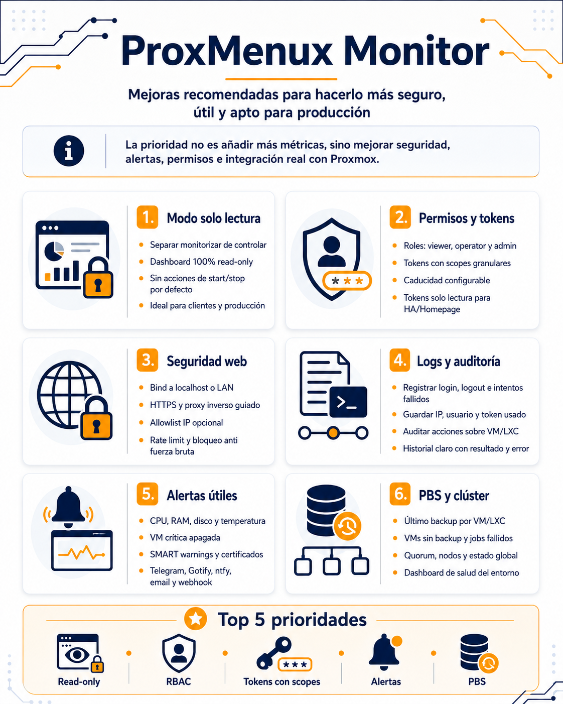
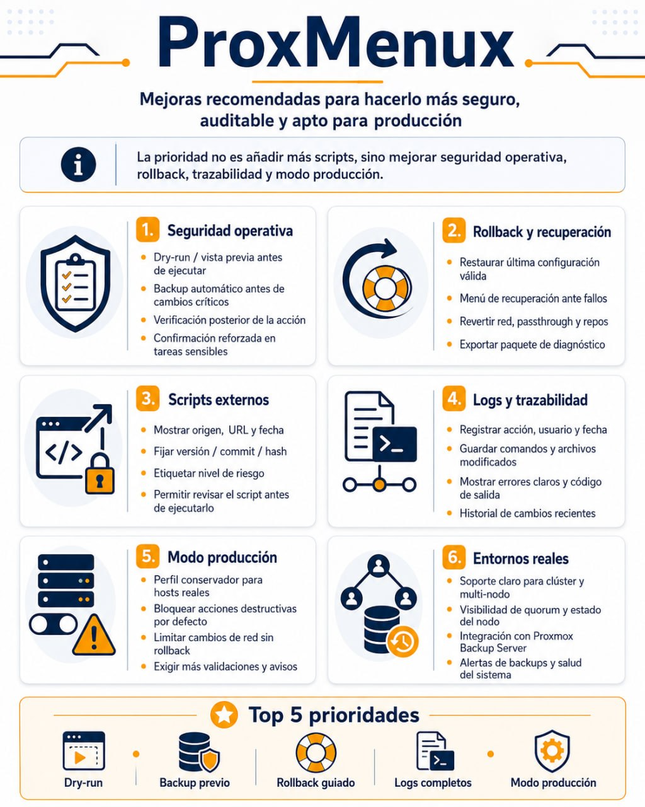

#    ProxMenux — Roadmap

> Last update: **2026-05-20** · Current version: **1.2.1.2-beta**
> 🇪🇸 Versión en español: [ROADMAP.es.md](ROADMAP.es.md)

This document is our roadmap to bring ProxMenux and ProxMenux Monitor
to a **production-ready** state. It is based on the two infographics
a community member prepared, enriched with a real audit of the
current codebase.

## 🖼️ Source infographics

The two infographics that seeded this roadmap are the work of
**[@pitiriguisvi](https://github.com/pitiriguisvi)** and summarise
the two main areas of work visually — thank you for the time and
for giving us such a clear starting point:

| ProxMenux Monitor (Dashboard) | ProxMenux (Scripts) |
|---|---|
|  |  |
| *Recommended improvements to make it safer, more useful, and production-ready* | *Recommended improvements to make it safer, auditable, and production-ready* |

**How we use this document:**

* The **Current state** table reflects what we already have today.
* The **Plan by version** marks what goes into each release.
* The **Shipped changes** section gets filled in as we close items,
  with the version they shipped in.

Symbols:

* 🟢 — Done and in production
* 🟡 — Partial (foundation exists, UI or full feature missing)
* 🔴 — Pending

---

## 🎯 Vision

> *"The priority is not to add more metrics or more scripts, but to
> improve security, alerting, permissions, auditability and real
> integration with Proxmox."*

ProxMenux is already a powerful tool for sysadmins running their own
node. The next leap is making it a tool **fit for production
environments and customers**:

* The operator must be able to give **read-only access** to third
  parties without worrying that they will touch anything.
* There must be an **auditable history** of what happened and who
  did it.
* Destructive changes must be **previewable and revertible**.
* The install must be operable in **conservative mode** when the
  node is not a lab.

---

## 📊 Current state

### ProxMenux Monitor (Dashboard)

#### 1️⃣ Read-only mode
| Item | Status | Notes |
|---|---|---|
| Separate monitoring from control | 🔴 | The dashboard mixes both today |
| 100 % read-only dashboard | 🟡 | The `read_only` scope exists for API tokens, but isn't exposed to the web user |
| No start/stop actions by default | 🔴 | Depends on the above |
| Ideal for clients and production | 🔴 | Lands when read-only mode is complete |

#### 2️⃣ Permissions and tokens
| Item | Status | Notes |
|---|---|---|
| viewer / operator / admin roles | 🔴 | Single-user today |
| Tokens with scopes | 🟡 | 2 scopes (`read_only`, `full_admin`), not granular |
| Configurable expiry | 🟡 | Currently fixed at 365 days |
| Read-only tokens for NA / homepage | 🟢 | Covered by `scope=read_only` |

#### 3️⃣ Web security
| Item | Status | Notes |
|---|---|---|
| Bind to localhost or LAN | 🔴 | Backend listens on `0.0.0.0:8008` |
| HTTPS and guided reverse proxy | 🟢 | Documented, ACME + self-signed CA trust |
| Optional IP allowlist | 🔴 | Does not exist |
| Rate limits and brute-force blocking | 🟡 | Login cooldown exists; not a configurable panel. Fail2Ban is optional |

#### 4️⃣ Logs and auditing
| Item | Status | Notes |
|---|---|---|
| Log login, logout and failed attempts | 🟡 | `auth_fail` is notified; no historical panel |
| Save IP, user and token used | 🟡 | Reaches the notification, not persisted for audit |
| Audit access to VM/LXC | 🔴 | Control actions are not recorded |
| Clear history with result and error | 🔴 | No "Audit" tab |

#### 5️⃣ Useful alerts
| Item | Status | Notes |
|---|---|---|
| High CPU, RAM, disk and temperature | 🟢 | Health Monitor + configurable thresholds |
| Snapshot / backup confirmed | 🟢 | `vzdump_complete` events |
| SMART warnings and prediction | 🟢 | `disk_failure_predicted` + `disk_io_error` tiers (1.2.1.2) |
| Telegram, Gotify, ntfy, email, webhook | 🟢 | 7 active channels |

#### 6️⃣ PBS and cluster
| Item | Status | Notes |
|---|---|---|
| Last backup per VM/LXC | 🟢 | Visible in the VM/CT modal |
| VMs with no backup and failed jobs | 🟡 | `vzdump_failed` is notified; aggregated view missing |
| Quorum, nodes, global state | 🟢 | Health tab + cluster events |
| Environment health dashboard | 🟢 | Health tab |

---

### ProxMenux (Scripts and post-install)

#### 1️⃣ Operational safety
| Item | Status | Notes |
|---|---|---|
| Dry-run / preview before applying | 🔴 | No general flag |
| Warnings before critical changes | 🟡 | Some dialogs, not uniform |
| Post-action verification | 🟡 | `update_component_status` records the result |
| Reinforced confirmation on sensitive tasks | 🟡 | `whiptail --yesno` in some scripts; not a rule |

#### 2️⃣ Rollback and recovery
| Item | Status | Notes |
|---|---|---|
| Restore last valid configuration | 🟢 | Full `backup_restore/` system (host backup + `apply_pending_restore`) |
| Recovery menu before failures | 🟡 | Manual restore exists, no preventive wizard |
| Revert network / post-install / groups | 🟡 | Backup snapshots, no granular per-subsystem rollback |
| Diagnostic bundle (`bug-report`) | 🔴 | No bundle |

#### 3️⃣ External scripts
| Item | Status | Notes |
|---|---|---|
| Lists, hashes and signature | 🔴 | Run without verification |
| Pin version / commit / hash | 🔴 | Helper-scripts pulled live from upstream |
| Risk-level label | 🟡 | New menu added "richer context"; no formal label |
| Show script before running it | 🔴 | No preview step |

#### 4️⃣ Logs and traceability
| Item | Status | Notes |
|---|---|---|
| Log action, user and date | 🟡 | Logs in `/var/log/proxmenux/`, not structured |
| Save commands and modified files | 🔴 | No tracking of what each script touched |
| Clear errors with exit code | 🟡 | Some scripts do; not a rule |
| Recent-changes history | 🔴 | No "what ProxMenux did on this host" UI |

#### 5️⃣ Production mode
| Item | Status | Notes |
|---|---|---|
| Conservative profile for the whole node | 🔴 | Concept does not exist |
| Block destructive actions by default | 🔴 | Same |
| Limit network changes without confirmation | 🟡 | Some scripts ask for confirmation |
| More validations and warnings | 🟡 | Incremental improvements, not as a mode |

#### 6️⃣ Real environments
| Item | Status | Notes |
|---|---|---|
| Clear, multilingual "this happened" output | 🟡 | `translate()` + `msg_*` work; final summary missing |
| Quorum / storage visibility | 🔴 | The Monitor shows it, but the **scripts** don't inspect or report quorum/storage state before acting |
| Proxmox Backup Server post-install | 🔴 | No PBS install/configuration script (the `Proxmox_Backup_Client.AppImage` is the client, not the server) |
| Fast failure detector for scenarios | 🟡 | Health Monitor; no "preflight" before each change |

---

## 🗺️ Plan by version

> Items are grouped by **value / effort** ratio, not strict order.
> The plan can be reordered based on feedback from the group's
> testers.

### v1.2.2-beta — *Cheap and high-impact*

Goal: close the gaps that already have a foundation in code and
deliver visible security gains without touching architecture.

* [ ] **Read-only mode for the web user.** Bind the existing JWT
      `read_only` scope to the interactive session. The UI hides
      action buttons (start/stop, run scripts, terminal) when the
      scope is not `full_admin`.
* [ ] **Audit log table + dashboard tab.** New SQLite table
      `audit_log(ts, user, ip, action, target, result, error)`.
      Hook into `flask_security_routes` and `flask_script_runner`.
      Render as a simple "Audit" tab.
* [ ] **IP allowlist.** New field in `Settings → Security →
      "Limit access to these IPs"`. `@require_allowed_ip` decorator
      applied to all blueprints.
* [ ] **Configurable API-token expiry.** `expires_at` field on the
      token metadata; honour it in `verify_token`.

### v1.2.3-beta — *Medium effort*

Goal: provide serious operational tools before applying changes.

* [ ] **Granular token scopes.** Minimum four: `read_only`,
      `vm_control`, `script_runner`, `full_admin`. The frontend
      shows which scopes the current token has.
* [ ] **Dry-run for post-install scripts.** `--dry-run` flag
      supported across all `scripts/post_install/` scripts. Output
      shows exactly what would change without touching the host.
* [ ] **Diagnostic bundle (`proxmenux bug-report`).** Tar.gz of
      `/var/log/proxmenux/`, `journalctl -u proxmenux-monitor`,
      `dmesg --since=24h`, `dpkg -l | grep -i proxmenux`,
      `managed_installs.json` and the `errors` / `disk_observations`
      tables. Tokens and secrets obfuscated in the output.
* [ ] **Aggregated "VMs with no backup" view.** New card in the
      Backups tab listing every VM/CT without a recent backup job,
      with direct shortcuts to PBS.

### v1.3.0 — *Major scope*

Goal: the leap to production. Requires a major release due to data
model and UX changes.

* [ ] **RBAC with viewer / operator / admin roles.** Multi-user,
      per-user password, per-session role. Migration from
      `auth.json` to a `users(id, username, password_hash, role,
      created_at, last_login)` table. Review every blueprint to map
      endpoints → minimum role.
* [ ] **Production mode.** Global flag in `/etc/proxmenux/profile`
      that toggles:
  * Reinforced confirmations
  * More aggressive anti-cascade
  * Destructive actions hidden or disabled
  * IP allowlist forced non-empty
  * `full_admin` tokens disabled in favour of `vm_control` + ack
* [ ] **Granular rollback per subsystem.** Building on the existing
      `backup_restore` infra, allow reverting only "Network", only
      "Post-install", only "Groups and permissions", etc.
* [ ] **Change history visible in the Monitor.** "Changes" tab
      listing every modification ProxMenux made on the host
      (file, before / after, responsible script).

### Probably out of scope

* **Cryptographic signing of upstream scripts.** Depends on the
  community-scripts pipeline (we don't control it). Maintaining our
  own signed mirror would be high effort for limited benefit.
  Closed unless an external decision changes it.

---

## 📦 Shipped changes

> This section is updated with every release. Without touching the
> plan above: here we note which items moved from pending (🔴 / 🟡)
> to done (🟢) and in which version.

| Date | Version | Item | Notes |
|---|---|---|---|
| — | — | — | No items closed yet from this roadmap |

---

## 🙏 Acknowledgements

* **[@pitiriguisvi](https://github.com/pitiriguisvi)** — author of the
  two original infographics this roadmap is built on.

---

## 💬 How to contribute

Anyone in the group can:

* Comment on the item they consider a priority or notice missing.
* Propose a new item using the table format
  (category + description + why it matters).
* Suggest moving items between versions if the ordering doesn't
  match their real use.

The roadmap is alive and gets reordered. The only rule is:
**items only change state 🔴/🟡 → 🟢 when there is code backing them
in a published release**.
